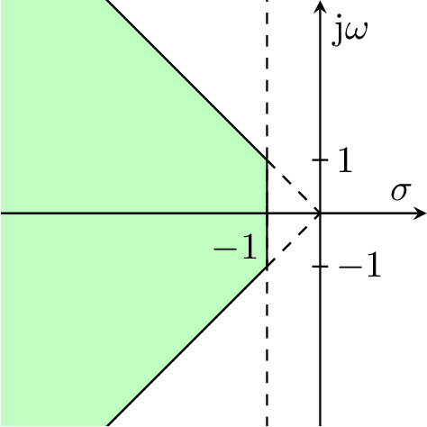
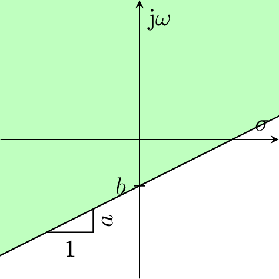
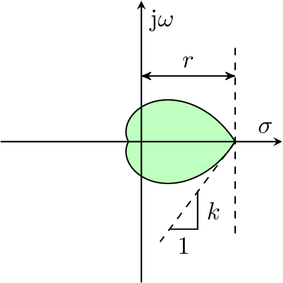
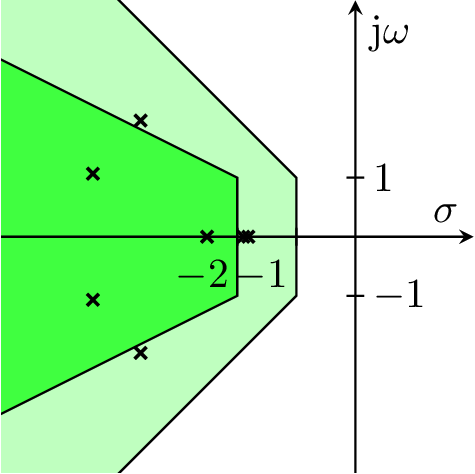

# gammasyn


## Purpose

Pole placement or pole assignment is a major control design method for linear time-invariant systems.
*gammasyn* is a toolbox for Matlab which enables an easy (robust) pole region assignment by
* offering an easy description of the (robust) pole region assignment and
* providing a unified interface for a large number of optimizers.

As this control design method relies on "heavy" optimization, this toolbox offers functionality to create and use compiled and paralleled versions of crucial functions, provided the necessary Matlab toolboxes are available.

It works with continuous time and discrete time systems.

This documentation assumes a basic knowledge of control systems and the concept of pole placement.


### Pole region assignment

With static and/or structured output feedback it is in general not possible to assign the poles of the closed loop system freely.
In this case the control objective may be softened in the sense that no specific values for the closed loop poles are demanded, but a region is specified, in which the poles of the closed loop have to lie.

Another application is robust control.
Here the aim is to design a single controller which has to work for a whole set of plants with different parameters.
In this case it is not possible to achieve the exact same pole locations for all admissible plants, even with full state feedback, and one has to soften the objectives to a region as well.

Especially in the robust controller design with rather large parameter variation it often proves to be a hard task to place all poles in the desired region.
With this in mind, this toolbox allows to define two fundamental regions:
* A "hard" region which translates to an optimization constraint. This region should assure stability and a minimal performance.
* A "soft" region which translates to an optimization objective. The optimization tries to place all poles within or as near as possible to this region, which may be motivated by some more eager performance goals.

In addition, individual pole regions can be defined for the different plants within a robust design.
This allows to define a good control performance for plants near the rated plant and only some basic behavior for plants under "extreme" working conditions.


## Installation and setup


### Prerequisities

* Matlab R2015B (might also work with older versions but is not tested) (Octave is not supported because it does not support packages)
* Toolboxes:
	* Matlab Coder (optional, if objective and constraint functions should be compiled. If the eigenvalue derivative calculation method of van der Aa is to be used, at least Matlab R2016A is needed to support runtime recursion in generated code)
	* Control Systems Toolbox (optional, if `tf` and `ss` system descriptions should be used)
	* Robust Control Toolbox (optional, if uncertain or parametric system descriptions should be used)
	* Symbolic Toolbox (optional, if symbolic constraints should be used)

If optimizers of the Optimization Toolbox or Global Optimization Toolbox of Matlab are used, the corresponding toolbox is necessary.


### Installation
This repository has to be cloned or copied to a location accessible for the local Matlab installation.
For the ease of installation and usage, it contains all necessary code including the open source optimizers.


### Setup
To set up *gammasyn* within Matlab the script *startup.m* has to be executed.
The effects of this script are only temporary, therefore it has to be executed anew after a restart of Matlab.

This script works directly in the base workspace.
It cleans up behind itself, i.e. it clears all variables used by it, but it does not check beforehand if the variables were in use.
Therefore, it is recommended to execute this script with a cleared base workspace to avoid an inconsistent state.


## Minimal examples

### Test system

For the minimal examples the test system is a simple one-mass-oscillator described by

```math
	<p align="center"></p>
```
The nominal parameters are ,  and .
For the robust design the parameters  and  are assumed to be uncertain, given by

```math
	<p align="center"></p>
```

The following function is used in the examples to construct the system for given parameter values ,  and :
```matlab
function [sys] = omo_sys(m, d, c)

	A = [0, 1; -c/m, -d/m];
	B = [0; 1/m];
	C = [1, 0];

	sys = struct('A', A, 'B', B, 'C', C);

end
```


### Pole region assignment

As simplest example static proportional output feedback is applied to the rated system

```matlab
sys = omo_sys(1, 10, 1000);
```

As only the position is measured, the poles cannot be placed arbitrarily.

#### Region

The target region is the sector shown in the following image.



It can be defined by
```matlab
polearea = [
	control.design.gamma.area.Line(1, 0),...
	control.design.gamma.area.Imag(1, 1)
];
```

For this example the solution can be determined analytically:

```math
	R \in [-991,\ -950]
```
( is negative, which means that it is actually positive feedback.
This is correct, as with this feedback structure the only possibility to dampen the system is to partly "compensate" the spring .)

#### Pole region assignment

```matlab
weight = 1;
R0 = 1;
Rfixed = [];
optimizer = optimization.solver.Optimizer.IPOPT;

gammaopts = control.design.gamma.GammasynOptions();

[R_opt, J_opt, info] = control.design.gamma.gammasyn(...
	sys,...
	polearea, weight,...
	Rfixed, R0, optimizer, gammaopts...
);
```


#### Additional objective term

With the code above, all solutions for  within the interval  are "equally good" solution of the feasibility problem.
The exact value found depends on the initial value and the optimizer used.
(You could change the start value to  to observe a difference.)

This means there exists a certain degree of freedom which can be used for other purposes.
The following code finds the controller among the feasible ones with the smallest norm of the feedback matrix.
In this case, it is just the  with the smallest absolute value, i.e. the unique solution now is .

```matlab
weight = 1;
R0 = 1;
Rfixed = [];
optimizer = optimization.solver.Optimizer.IPOPT;

gammaopts = control.design.gamma.GammasynOptions(...
	'type', GammaJType.NORMGAIN,...
	'objective.normgain.R', (1)...
);

[R_opt, J_opt, info] = control.design.gamma.gammasyn(...
	sys,...
	polearea, weight,...
	Rfixed, R0, optimizer, gammaopts...
);
```


### Robust pole region assignment

#### Systems

Now it is assumed that the mass and the damping coefficient are not exactly known but only intervals are given.
To apply the multiple model approach in a first step the "corner" models as well as the rated model are build and stored in one vector.

```matlab
m = [0.9, 1.1];
d = [8, 12];
c = 1000;

sys = [
	omo_sys(m(1), d(1), c),...
	omo_sys(m(2), d(1), c),...
	omo_sys(m(1), d(2), c),...
	omo_sys(m(2), d(2), c),...
	omo_sys(mean(m), mean(d), c)
];
```

#### Region

The target pole region is the same as in the example above.

```matlab
polearea = [
	control.design.gamma.area.Line(1, 0),...
	control.design.gamma.area.Imag(1, 1)
];
```

#### Robust pole region assignment

Also the call to *gammasyn* is the same as above, the only difference is that `sys` now contains five instead of one system.

```matlab
weight = 1;
R0 = 1;
Rfixed = [];
optimizer = optimization.solver.Optimizer.IPOPT;

gammaopts = control.design.gamma.GammasynOptions();

[R_opt, J_opt, info] = control.design.gamma.gammasyn(...
	sys,...
	polearea, weight,...
	Rfixed, R0, optimizer, gammaopts...
);
```

This task proves to be feasible, i.e. there exists a controller gain for which the poles of all five closed loops lie within the specified region.


The following image shows the poles of all five closed loop systems


This multiple model approach is heuristic and makes no guarantees about the -stability of the other systems described by the given parameter ranges.
It is advisable to check the properties for a larger subset of the admissible systems.
This is made in the following image, where the poles of 100 additional closed loop systems are shown in gray.


## Method/Theory

### System and Controller

This framework considers static, possibly structured output feedback only.
As will be discussed later, this is actually not a restriction, as any dynamic feedback can be cast into this form.

In the simplest form for this framework a system is given by the three matrices ,  and  of the state space representation

```math
	<p align="center"></p>
```
and the control loop is to be closed with the controller

```math
	u = -R y + F r
```
where  is the reference value.
This leads to a closed loop

```math
	\dot x = (A - B R C) \cdot x + B F r
```
whose poles  are the solutions of the eigenvalue problem

```math
	\det(I \lambda_\nu - (A - B R C)) = 0
```


#### Mass matrix

As a small notational convenience in some cases, the model can be described as

```math
	<p align="center"></p>
```
with the *invertible* mass matrix .

The feedback has the same form as above which leads to the associated eigenvalue problem

```math
	\det(E \lambda_\nu - (A - B R C)) = 0
```
to determine the eigenvalues or poles of the closed loop system.


#### Differential feedback

To allow modeling true differential feedback, the model can be extended to

```math
	<p align="center"></p>
```
for which the controller has the structure

```math
	u = - R y + K y' + F r
```

* The prime-notation  is not the same as  but allows that not all or others outputs are used for the differential feedback than for the "normal" feedback. If all outputs should be used for the differential feedback, i.e. , then  can be chosen.
* The differential feedback is defined as positive feedback whereas the normal feedback is defined as negative feedback. This is a deliberate choice which leads to a more symmetric generalized eigenvalue problem

```math
	\det((I - B K C') \cdot \lambda_\nu - (A - B R C)) = 0
```


#### Process variables

As the model used here is an augmented system, as discussed below, the output  doesn't generally reflect the actual process variables.
Therefore, the process variables for which sensible reference values (or set points) exist are described by an additional output equation:

```math
	<p align="center"></p>
```


#### Full continuous time model

Combining all extensions, the most general system description used by this toolbox is

```math
	<p align="center"></p>
```
where  must be an invertible matrix and the controller is given by

```math
	u = - R y + K y' + F r
```

The eigenvalues or poles of the closed loop are the solution of the generalized eigenvalue problem

```math
	\det((E - B K C') \cdot \lambda_\nu - (A - B R C)) = 0
```

The structure is depicted here:


#### Discrete time model
The discrete time model is defined analogously to the continuous time case as

```math
	<p align="center"></p>
```
where  must be an invertible matrix and the controller is given by

```math
	u_k = - R y_k + K y'_k + F r_k
```

The discrete time analogous "derivative" output  is only defined for accordance with the continuous time system matrices and serves no engineering purpose because it results in a non causal system.

The structure is depicted here:


### Augmented System

The system given by the structure described above is an augmented system in the sense that it may contain parts of the controller.

The approach applied in this toolbox relies on static structured output feedback.
However, this is a very general approach, as all the controller dynamics can be added to the system, resulting in the "augmented system".

If for example the system

```math
	<p align="center"></p>
```
is to be controlled by a PI-controller

```math
	u = K_\mathrm{P} e + K_\mathrm{I} \int e \mathrm{d} \tau
```
with ,  being the reference value, which can be written in the state space representation

```math
	<p align="center"></p>
```
the resulting augmented system is

```math
	<p align="center"></p>
```
to which the static output feedback

```math
	u_\mathrm{a}
		=
			- \underbrace{<p align="center"></p>}_{K} y_\mathrm{a}
			+ <p align="center"></p> r
```
is applied.
This is a *structured* feedback, as the second row of the feedback matrix  doesn't contain any free parameter but values which must not be altered by the optimizer.

More generally, if the given system is controlled with a general dynamic controller

```math
	<p align="center"></p>
```
(where  to  may be structured) the augmented system is

```math
	<p align="center"></p>
```
which is closed by

```math
	u_\mathrm{a} = - \underbrace{<p align="center"></p>}_{K} y_\mathrm{a} + \underbrace{<p align="center"></p>}_{F} r
```
where  (and ) are generally structured corresponding to the structure of  to  (and  and ).

As such structure is mandatory to achieve given controller structures as for example PI or PID controllers, this toolbox provides the possibility to define such structures.


### Pole region

The basic aim of this control design procedure is to determine  and  such that all poles , , of the closed loop system lie within a certain region  of the complex plane.

This toolbox distinguishes between two regions:
* : All poles  must lie within this region to consider the problem solved.
* : All poles should lie within or as near as possible to this region.


For a compact notation, the real part of a complex value is written as  and the imaginary part as , i.e. for example

```math
	\lambda_\nu = \sigma_\nu + \mathrm{j} \omega_\nu
```


#### Mathematical description of pole regions

A region is defined by one or the intersection of more areas.
Here, "area" refers to the "left side" of a curve in the complex plane.

```math
	z_\rho(\sigma,\ \omega)
		<p align="center"></p>
```

Depending on the optimizer, a function  should be differentiable twice after each argument.

A region is defined as a set of areas, .
The condition that all poles lie within this area translates to

```math
	z_\rho(\sigma_\nu,\ \omega_\nu) \leq 0 \forall \rho = 1,\ \ldots,\ r, \ \forall \nu = 1,\ \ldots, n
```

For the robust case, where  models are to be considered, the condition is

```math
	z_{\mu \rho}(\sigma_{\mu \nu},\ \omega_{\mu \nu}) \leq 0 \forall \rho = 1,\ \ldots,\ r_\mu, \ \forall \nu = 1,\ \ldots, n_\mu, \ \forall \mu = 1,\ \ldots,\ m
```
* The region may depend on the model . This can be important from a practical point of view. If the uncertainty is rather large one may have to loosen the performance goals, described by the region, for corner case models.
* The system order  may depend on the model  as well.

As there are two pole regions,  and , there are also two sets of functions :  and .


### Problem formulation

The aim is to determine the matrices of the controller

```math
	u = - R y + K y' + F r
```


#### Controller structure

Generally it is structured feedback, that is, the matrices cannot be chosen freely but certain entries are fixed and there may be additional conditions to be respected.
Mathematically fixed entries and linear dependencies between different entries can be expressed in the form
```math
	<p align="center"></p>
```
which allows dependecies of entries of the same matrix only or the more general form
```math
	<p align="center"></p>
```
where  is the vectorization operator.
Mathematically the latter form comprises the precedent three equations, but this framework allows the specification in either form or both forms simultanously.

The notation used here is versatile.
Of course equality conditions of the form  actually simply reduce the effective number of optimization variables.
The same is valid for linear equation constraints between two and more optimization variables.
This is used by the toolbox when it constructs the problem, but for the sake of readability it is not denoted explicitly here.

The possibility to formulate linear equality conditions is necessary for the design of a structured controller.
Not necessary but possible are linear inequality conditions (aside from the ones resulting from the pole region constraints which are introduced below), which can be specified in the form

```math
	<p align="center"></p>
```
and
```math
	<p align="center"></p>
```

To provide more flexibility, this toolbox allows also for nonlinear equality and inequality conditions,

```math
	<p align="center"></p>
```

Instead of referring to these seven equations and seven inequalities in the feasibility and optimization problems that follow, it is used the shorter notation

```math
	(R,\ K,\ F) \in \mathcal{S}
```
For example

```math
	\min_{(R,\ K,\ F) \in \mathcal{S}} J
```


#### Pole regions

These are translated into constraints or into an objective function, depending on the type of region (hard or soft) and the capabilities of the optimizer.


##### Hard pole region - Constrained optimization

If the optimizer supports inequality constraints directly,

```math
	<p align="center"></p>
```

If no additional objective function is given, i.e. , this is a feasibility problem.

The weights  are not necessary from a theoretical - and mostly practical - point of view.
Generally they should be set to 1.

* The weights can be used to reverse the left and right side of an area.
* They could be used to "help" the optimizer to find a solution.


##### Hard pole region - Unconstrained optimization using a loss function

If the optimizer doesn't support inequality constraints (or for the soft pole region ) the inequality constraints have to be transformed into an objective function using loss functions.

In most cases the resulting objective function has the form

```math
	J_\Gamma = \sum_{\mu=1}^m \sum_{\nu=1}^{n_\mu} \sum_{\rho=1}^{r_\mu} j(z_{\mu \rho}(\sigma_{\mu \nu},\ \omega_{\mu \nu}))
```
i.e. for each combination of model, pole and area the value of  is assessed by some loss function  and the sum is used as objective function.
The following table lists the most common choices for :

| loss function |  |
| --- | --- |
| Quadratic loss function |  |
|  loss function |  |
| Exponential loss function |  |
| Logarithmic loss function |  |

* The downside of the  loss function is that it is not differentiable on the border curves.
* The logarithmic loss function is an inner penalty function which is not defined for any pole not lying within the defined region. Therefore, it can only be used if the initial value for the optimization variables is feasible.
* The exponential loss function may lead to very high values if the poles are far out of the regions. This may results in problems if the initial value for the optimization variables are not chosen carefully. In this case, the quadratic loss function may be a better choice.

An alternative objective function is based on the Kreisselmeier-Steinhauser function,

```math
	J = f_\mathrm{max,KM} + \frac{1}{\rho_\mathrm{KM}} \cdot \ln\left( \sum_{\mu=1}^m \sum_{\nu=1}^{n_\mu} \sum_{\rho=1}^{r_\mu} \exp(\rho_\mathrm{KM} w_{\mu \rho} z_{\mu \rho}(\cdot,\cdot) - f_\mathrm{max,KM}) \right)
```
which is an (rough) approximation of .

The resulting optimization problem is

```math
	(R^\star,\ K^\star,\ F^\star) = \underset{(R,\ K,\ F) \in \mathcal{S}}{\arg \min} J_{\Gamma, \mathrm{hard}}
```

#### Soft pole region

If a constrained optimizer is used, a second pole region can be defined.
This soft region is treated in the same way as unconstrained optimizers treat the hard pole region, i.e.
* The soft pole region 
* It makes only sense if the optimizer supports inequality constraints


```math
	<p align="center"></p>
```


#### Additional objective terms

Additional objective functions can be selected.


##### Controller norm
In order to get a small control action, the controller matrices can be minimized by the choice of `GammaJType.NORMGAIN` as objective type with the objective function
```math
	J_\mathrm{Ctrl} = \| W_\mathrm{R} \odot (R - S_\mathrm{R}) \|_\mathrm{F}^2 + \| W_\mathrm{K} \odot (K - S_\mathrm{K}) \|_\mathrm{F}^2 + \| W_\mathrm{F} \odot (F - S_\mathrm{F}) \|_\mathrm{F}^2
```
where the matrices  of appropriate dimension are chosen for weighting.


##### Condition of the eigenvector matrix
For greater robustness of the closed loop, the condition number of the eigenvector matrix can be minimized by the choice of `GammaJType.EIGENVALUECONDITION` with the objective function
```math
	J_\mathrm{EV} = \mathrm{cond}(V)
```

##### Norm of the Lyapunov matrix
Another possibility for achieving greater robustness against time varying unstructured uncertainty in the system matrix of the closed loop, is the minimization of the norm of the Lyapunov matrix of the closed loop system, which can be achieved by the choice of `GammaJType.LYAPUNOV`.
The objective function in this case has the form
```math
	J_\mathrm{Lyap} = -\frac{1}{\|\tilde{P}_{11}\|_{F}^2} + \frac{1}{\|\tilde{P}_{22}\|_{F}^2}
```
where the matrices  in the Lyapunov equation can be chosen independently for every multiple model.
The matrices  and  which correspond to the unstable and stable part of the system respectively stem from a Schur decomposition of the closed loop system matrix where the unstable system matrix is replaced by  in the continuous time case and  in the discrete time case.


#### Complete optimization problem

##### Constrained optimizers

For constrained optimizers the "full" optimization problem is
```math
	<p align="center"></p>
```

For unconstrained optimizers the "full" optimization problem is
```math
	(R^\star,\ K^\star,\ F^\star) = \underset{(R,\ K,\ F) \in \mathcal{S}}{\arg \min} w_\Gamma J_\mathrm{\Gamma,hard} + w_\mathrm{Ctrl} J_\mathrm{Ctrl} + w_\mathrm{EV} J_\mathrm{EV}
```
In this case only "simple" linear equality conditions can be imposed for the entries of ,  and  which can be incorporated directly by reducing the number of optimization variables.


## Usage


```matlab
[R_opt, J_opt, info] = control.design.gamma.gammasyn(...
	sys,...
	polearea, weight,...
	Rfixed, R0, optimizer, gammaopts,...
	[Rbounds [, Rnonlin]]...
);
```

### Return values

* `R_opt`: Found solution, the format depends on relevant
	* If `sys` defines neither  nor  and , then `R_opt`  is simply a numerical matrix corresponding to 
	* If `sys` defines all matrixes, then `R_opt` is a cell array with three numerical entries corresponding to the solution 
* `J_opt`: value of the objective function at `R_opt`
* `info`: structure with additional information about the result


PLEASE NOTE: The current version of the toolbox "ignores" the prefilter .
Current work aims to extend the toolbox for the design of coupling and decoupling controllers.
In theses cases the manipulation of  is necessary.
Therefore, it is included in the API.
But in the current release version,  will always be returned as the initial value or a zero matrix.


### System `sys`

The argument `sys` describes one or more systems.
A system is described by a `struct` whose fields correspond to the matrices of a state space realization.
If more than one system is given, `sys` is a vector of structs.

These systems are always the augmented systems which may include (parts of) the controller.

In the simplest form a system is given by the three matrices ,  and  of the state space representation

```math
	<p align="center"></p>
```

Optionally, this toolbox allows to specify a mass matrix and to design ideal differential feedback as well as it can design a prefilter.
The "full" system form is given by

```math
	<p align="center"></p>
```
where  must be an invertible matrix.

| Fields | Remark |
| --- | --- |
| A, B, C | Minimum form |
| C_dot | Optional |
| E  | Optional |
| C_ref, D_ref | Optional |


PLEASE NOTE: A field D may be given (and is also returned by functions of this toolbox), but it must be a zero matrix of compatible size! (Future versions may allow systems with feed through but in the current version a non-zero D results in undefined behavior.)

If the additional flexibility of differential feedback or reference outputs is not needed, it is also possible to supply system descriptions that are included in Matlab's Control System toolbox as `ss`, `tf`, `uss` or `dss`.


### Controller structure `Rfixed`

The controller structure is given by the mandatory argument `Rfixed` as well as the optional arguments `Rbounds` and `Rnonlin`.

In the following, the structure of one of the matrices ,  and  are explained.
(It is the same for each one.)
They are combined by forming a cell array, i.e. if all three matrices are used:
```matlab
Rfixed = {Ra_fixed, Ka_fixed, Fa_fixed, RKFa_fixed}
```
If no dependencies between different gain matrices are needed, this can be reduced to
```matlab
Rfixed = {Ra_fixed, Ka_fixed, Fa_fixed}
```
If only  and  is used,
```matlab
Rfixed = {Ra_fixed, Ka_fixed}
```
and if only  is used,
```matlab
Rfixed = {Ra_fixed}
```

* Fixed values

	`Ra_fixed = {Rfix, Rval}`

	`Rfix` is a logical matrix with `true`-entries marking the fixed entries.
	`Rval` is a numerical matrix where the fixed values are given.
	The non-fixed values are marked as `NaN` in this matrix.

	(This is redundant, as `Rfix = ~isnan(Rval)` but is needed to distinguish the format.)

	For example, if  with the parameters  and  being free, the definition of the structure would be
	```matlab
		{[false, false; true, true], [NaN, NaN; 1, 0]}
	```

* Linear dependencies between controller parameters

	`Ra_fixed = {Zlhs, Zrhs}`

	Linear dependencies are given by linear equations of the form

	```math
	\sum_{i,j} (Z_k \odot R) = z_k
	```
	where  means element-wise multiplication (Hadamard product).
	If there is more than one equation , the matrices  are stacked along the third dimension in `Zlhs`.
	I.e, if `Nz` linear dependencies are specified, the dimensions of `Zlhs` and `zrhs` are `size(Zlhs): [size(R, 1), size(R, 2), Nz]` (for the combined constraints `size(Zlhs): [size(R, 1), size(R, 2) + size(K, 2) + size(F, 2), Nz]`) and `size(Zrhs): [Nz, 1]`, resp.

	For example, if  with  being free but subject to the constraints  and , the definition of the structure would be
	```matlab
		{cat(3,...
			[1, -1, 0; 0, 0, 0],... % lhs of r_1 - r_2 = 0
			[1, 0, -1; 0, 0, 0],... % lhs of r_1 - r_3 = 0
			[0, 0, 0; 1, -1, 0],... % lhs of r_4 - r_5 = 0
			[0, 0, 0; 0, 0, 1]...   % lhs of r_6 = 1
			),...
		[
			0;    % rhs of r_1 - r_2 = 0
			0;    % rhs of r_1 - r_3 = 0
			0;    % rhs of r_4 - r_5 = 0
			1     % rhs of r_6 = 1
		]
		}
	```
	* As said above, linear dependencies for `K` and `F` can be specified in the same way in `Ka_fixed` and `Fa_fixed`. For dependecies involving all matrices `RKFa_fixed` can be used, specifying `{Zlhs, Zrhs}` corresponding to
	```math
		\sum_{i,j} (Z_k \odot <p align="center"></p>) = z_k
	```
* Symbolic dependencies between controller parameters
If the Symbolic Math Toolbox is available, it is also possible, to formulate the controller coefficient constraints as symbolic expressions.
This can be achieved by specifying the symbolic gain matrix in the first element of a cell array and the symbolic equation system in the second element of the cell array for every gain matrix like in
```matlab
	R = sym('R', [2, 2]);
	K_I = sym('K_I');
	K_P = sym('K_P');
	R(1, 1) = K_P;
	R(1, 2) = K_I;
	Ka_fixed = {R, [
		K_I == K_P;
		R(2, 1) == 1;
		R(2, 2) == 0
	]};
```
for the proportional part of a PID controller where integral and proportional action should have the same coefficient value.


As it may be cumbersome to construct the augmented system as well as to specify the structure of the controller matrices manually for the desired controller structure, this toolbox provides helper functions for common controller structures.

Alternatively the capabilities of the parameterized and uncertain system objects of the Control System Toolbox and the Robust Control Toolbox can be used.


#### Predefined controller setups

| Class | Parameters | Description |
| --- | --- | --- |
| ConstantOutputFeedback | |
| DynamicOutputFeedback | nD | nD: order of the dynamic controller |
| ObserverDirectOutputFeedback | |
| ObserverOutputFeedback | |
| ObserverStateFeedback | |
| PDOutputFeedback | |
| PIDOutputFeedback | |
| StateFeedback | |


```matlab
sys = omo_sys(1, 10, 1000);

controller = control.design.outputfeedback.PIDOutputFeedback();

% construct augmented system
sys_augmented = controller.amend(sys);

% get structure description
[Ra_fixed, Ka_fixed] = controller.gainpattern(sys);
Rfixed = {Ra_fixed, Ka_fixed};
```
This works as well if `sys` contains several systems:
```matlab
m = [0.9, 1.1];
d = [8, 12];
c = 1000;

sys = [
	omo_sys(m(1), d(1), c),...
	omo_sys(m(2), d(1), c),...
	omo_sys(m(1), d(2), c),...
	omo_sys(m(2), d(2), c),...
	omo_sys(mean(m), mean(d), c)
];

controller = control.design.outputfeedback.PIDOutputFeedback();

sys_augmented = controller.amend(sys);

[Ra_fixed, Ka_fixed] = controller.gainpattern(sys);
Rfixed = {Ra_fixed, Ka_fixed};
```


#### Using Matlab system definitions
Instead of supplying the system descripton as a structure with the neccessary fields, it is also possible to use a `tf` or `ss` object (or array in case of multiple models) as system.
```matlab
sys = omo_sys(1, 10, 1000);
sys = ss(sys.A, sys.B, sys.C);

controller = control.design.outputfeedback.PIDOutputFeedback();

% construct augmented system
sys_augmented = controller.amend(sys);

% get structure description
[Ra_fixed, Ka_fixed] = controller.gainpattern(sys);
Rfixed = {Ra_fixed, Ka_fixed};
```


### Initial value `R0`

An initial value for the feedback matrix  must be given.

#### Numerical value
It must have the same dimension as , i.e. `size(R0) : [size(sys.B, 1), size(sys.C, 2)]`.
If  contains fixed values, the corresponding entries of `R0` are ignored.

An inital value for the differential feedback matrix  may be given.
In this case, `R0` is a cell array containing two matrices,
```matlab
R0 = {Ra0, Ka0}
```
If the structure employs differential feedback but no initial value for  is given, it is set to .
Supplying an initial value for the prefilter gain `` is possbile with three matrices
```matlab
R0 = {Ra0, Ka0, Fa0}
```


#### Multiple numerical values

It is possible to provide more than one initial value.
In this case the optimization problem is solved for each (set of) initial value(s) and the best solution is returned.

To provide multiple initial values, instead a two-dimensional matrix `R0`, a cell array of two two-dimensional matrices `{Ra0, Ka0}` or a cell array of three two-dimensional matrices `{Ra0, Ka0, Fa0}` three-dimensional values have to be provided.


#### InitialValue
If the user supplied initial value for optimization is to be changed by a further processing step to make it more suitable for the pole region assignment problem by taking the multiple models into account, this is possible by the use of the `InitialValue` class.
This class is a container for different `InitialValueElement` objects that may implement this processing, e.g. using the `oplace` toolbox for design of structurally constrained output feedback controllers with pole assignment developed at the institute of automatic control at the TU Darmstadt.
Currently this task is left to the user and there are only two simple `InitialValueElement` classes defined, `GammasynInitialValueElement` which is basically only a wrapper for numeric initial values described above and `RandomInitialValue` which returns random initial values of appropriate size.
An initial value consisting of a random value and a numeric value can be constructed by
```matlab
R0 = control.design.gamma.InitialValue(...
	control.design.gamma.RandomInitialValue(2),...
	control.design.gamma.GammasynInitialValueElement(Ra0)...
)
```
which creates two random initial values and the numeric initial value `Ra0`.


### Region definition

A region is defined by one or the intersection of more areas.
Here, "area" means a function which maps any point of the complex plane, , to a real number, .
It is zero on the border of the area, has negative values on the side at which poles must or should lie and positive values on the other side.
It should be differentiable twice.

These are translated into constraints or into an objective function, depending on the type of region (hard or soft) and the capabilities of the optimizer.
If it is translated to an objective function, the area functions are applied to a loss function defined with `GammaJType`.

To allow for an efficient optimization, an area should not only provide its value when called for a certain point of the complex plane, but also returns its first (and second) derivatives.

For the common areas these functions are predefined, such that there should be seldom the need to define custom area functions.


Generally, a region (hard or soft) is defined by a row vector of `control.design.gamma.area`-Objects, for example
```matlab
region = [
	control.design.gamma.area.Line(1, 0),...
	control.design.gamma.area.Imag(1, 1)
]
```
If a robust design is performed, i.e. there is more than one model defined, *and* different regions should be given for different models, then the regions are defined by a matrix, where every row describes the region for the corresponding model in the `sys`-vector.
(If the same region is used for all models, only one has to be defined.)
For three systems the regions may be defined for example by
```matlab
region = [
	control.design.gamma.area.Line(1, 0), control.design.gamma.area.Imag(1, 1);
	control.design.gamma.area.Line(0.7, 0), control.design.gamma.area.Imag(1, 1);
	control.design.gamma.area.Line(0.5, 0), control.design.gamma.area.None()
]
```
If the number of areas differs for the different regions, the `None`-area can be used to fill the rows of matrices.

If both a hard and a soft region are refined, `polearea` is a cell array with two elements, each containing a vector of areas:
```matlab
polearea = {hardregion, softregion}
```
If only a hard region is defined, the soft region can be set to an empty matrix
```matlab
polearea = {hardregion, []}
```
or equivalently, `polearea` can be set directly as the hard region vector or matrix
```matlab
polearea = hardregion
```

NOTE: If an unconstrained optimizer is used, only the hard region is used.
I.e. if a soft region is defined, it is simply ignored.


If a constrained optimizer is used, and the user wants to specify a soft region only, that could be achieved with
```matlab
polearea = {control.design.gamma.area.None(), softregion}
```
explicitly or by specifying `[]` implicitly.
However, it is advisable to specify at least the "minimal" hard region, i.e. the left half plane for continuous time systems or the unit circle for discrete time systems.


#### Predefined areas

| Area | Parameters | Description | |
| ----------- | --- | --- | --- |
| Circle <br/> Circlesquare | R | R: Radius | 
| Ellipse <br/> Ellipsesquare | a, b | a: semi axis along real axis <br/> b: semi axis along imaginary axis |  
| Hyperbola <br/> Hyperbolasquare | a, b | a: semi axis along real axis <br/> b: semi axis along imaginary axis | 
| Imag | a, b | Vertical line <br/> For left part: a: 1, b: neg. position of line on real axis <br/> For right part: a: -1, b: position of line on real axis |  
| Line | a, b | a: slope <br/> b: intercept <br/> The "left" area is always the part above the line! | 
| LogSpiral | r, k | r: start point on real axis <br/> k: polar slope | 
| None |
| PolyEllipse <br/> PolyEllipsesquare |

All areas (except None, where it is ignored) accept an additional optional parameter *shift*.
This parameter is a complex number which allows to shift the origin of the "base" coordinate system defining the area.
I.e. for circles, *shift* defines the center point.
If *shift* is not specified, it is set to zero.


##### "square" versions


Some of the areas are more naturally defined by a squared expression.
Taking the square root results in a function that may not be differentiable, if the argument of the root can attain zero.
Therefore, it may be a good choice to work with the square form directly.

However, depending on the usage this may lead to other problems if squared and non-squared forms are mixed, as in the first case the "distance" is measured squared and in the latter it is measured "normally".
Therefore, the non-squared versions are provided as well.

And an additional definition has to be added, if the shape doesn't distinguish between the left and right half plane.


#### Custom areas

```matlab
z = areafun(re, im)
```

```matlab
[z, dzdre, dzdim] = areafun(re, im)
```

```matlab
[f, dfdre, dfdim, d2fdredre, d2fdimdre, d2fdredim, d2fdimdim] = areafun(re, im)
```


##### Example

In this simple example, the _exterior_ of a circle with radius  is chosen as desired area.
In square form, the area is defined by

```math
	z(\sigma,\ \omega) = R^2 - \underbrace{(\sigma^2 + \omega^2)}_{\textnormal{distance}^2}
```
which gives the derivatives

```math
	\frac{\mathrm{d}z}{\mathrm{d}\sigma} = -2 \sigma
	\qquad
	\frac{\mathrm{d}z}{\mathrm{d}\omega} = - 2 \omega
```

Accordingly, the function could be implemented as
```matlab
function [z, dzdre, dzdim] = mindistance_area(re, im, R)
	z = R^2 - re^2 - im^2;
	dzdre = -2 * re;
	dzdim = -2 * im;
end
```
and used as
```matlab
polearea = @(re, im) mindistance_area(re, im, 5)
```
Multiple regions can be defined by simply letting the function return row vectors of function and gradient values instead of scalars.


### `weight`: Weighting of areas

As described above, each area and model is associated with a weight  which appears within the inequality constraints or the derived loss functions.

`weight` is structured like `polearea`.
If both a hard and a soft region is defined, `weight` is a cell array with two numeric elements (scalar, vector or matrix)
```matlab
weight = {hardweight, softweight}
```
If only a hard region is given, `weight` might be set directly to corresponding numeric element
```matlab
weight = hardweight
```

`hardweight` and `softweight` can be defined in one of the following forms:

* Scalar value: All weights (for all areas and all models) are set to this value. This is the standard choice for the hard region, where all weights are normally set to one.
* Row vector: Each entry is the weight of the corresponding area. If more than one model is used, the weights may differ for the different areas, but they are the same for all models.
* Column vector: Each entry is the weight for all areas for the corresponding model.
* Matrix: Each entry is the weight for the corresponding model (row) and area (column).


**Remarks:**

* If the hard region is translated to inequality constraints, the weights for the hard region are more academic (a weight might be set to a negative value to inverse the area). With some experience the weights may be used to "help" the optimizer to find a feasible solution.
* If negative weights are used, the option `allownegativeweight` must be set to true.


### `gammaopts`: Objective function and associated options

The options, which are described below, can be set using the function
```matlab
gammaopts = control.design.gamma.GammasynOptions(parameter, value, ...)
```
The parameter name may contain dots, for example `'objective.normgain.K`.


| Option | Remark |
| --- | --- |
| `type` | objective functions, element of `GammaJType` |
| `objective.normgain.{R, K, F}`| Weights for minimization of controller norm |
| `objective.normgain.{R_shift, K_shift, F_shift}`| Shift for minimization of controller norm |
| `objective.kreisselmeier.{rho, max}`| Parameters for Kreisselmeier objective function |
| `objective.lyapunov.Q`| right hand side matrix for Lyapunov equation |
| `weight` | weight for the used objective functions
| `allowvarorder` | true, {false}: indicator if systems with different numbers of states are allowed |
| `allownegativeweight` | true, {false}: indicator if negative area weights are allowed |
| `usecompiled` | true, {false}: indicator if generated code should be used |
| `numthreads` | number of parallel threads to use
| `eigenvaluederivative` | method for calculation of eigenvalue derivatives to use
| `eigenvaluefilter` | filter for eigenvalues to use
| `strategy` | strategy for solution to use
| `errorhandler` | type of error handler to use
| `errorhandler_function` | error handler function to use in case of `GammaErrorHandler.USER`
| `system.usereferences` | indicator if output matrix `C` should be used as  for matlab system descriptions
| `system.usemeasurements_xdot` | indicator if output matrix `C_dot` should be used as  for matlab system descriptions
| `system.samples` | structure with fields equal to the names of uncertain blocks in the `uss` system description to indicate the number of multiple models to create from the corresponding uncertain parameter
| `system.Blocks` | structure with fields equal to the names of uncertain blocks in the `uss` system description to indicate the number of multiple models to create from the corresponding uncertain parameter


#### Objective functions `type`

With this option the type of loss function used for the soft region (constrained optimizers) or the hard region (unconstrained optimizers) is selected.
Also, additional objective function terms can be selected.
`type` is a scalar or a vector of elements of the enumeration `GammaJType`.
The elements are listed in the following table and some examples are given below.

| GammaJType | Remark | Loss function
| --- | --- | --- |
| ZERO | no objective function (pure feasibility problem) |  |
| MAX |  loss function |  |
| SQUAREPENALTY | Quadratic loss function |  |
| EXP | Exponential loss function |  |
| LINEAR | (*) linear weighting of pole areas |  |
| SQUARE | (*) *signed* quadratic weighting of pole areas |  |
| CUBIC | (*) cubic weighting of pole areas |  |
| LOG | (*) Logarithmic loss function |  |
| KREISSELMEIER | vector performance index weighting according to Kreisselmeier |  |
| EIGENVALUECONDITION | (**) eigenvector matrix condition objective function ||
| NORMGAIN | (**) norm of gain matrices |  |
| LYAPUNOV | (**) norm of Lyapunov matrix of closed loop ||

(*) These loss functions are unbounded below.
This may lead to unexpected results if the closed loop possesses conjugate complex poles.
They are provided mainly for experimental and academic reasons.

(**) These loss functions don't assess the poles at all but are motivated by the aim to get a robust or economic controller.


For example, if `type` is set to
```matlab
	GammaJType.SQUAREPENALTY
```
the quadratic loss function is used and none of the additional objective functions  and  is added.

If `type` is set to
```matlab
	[GammaJType.SQUAREPENALTY; GammaJType.NORMGAIN]
```
the quadratic loss function is used and the controller norm is added.
To weight these two terms, the option `weight`can be set appropriately.

If `type` is set to
```matlab
	[GammaJType.ZERO; GammaJType.NORMGAIN]
```
only the norm of the controller is used in the objective function.
This can be a sensible choice when constrained optimizers are used, as the hard region is still respected.
When an unconstrained optimizer is used, this is not a sensible choice, as the pole region is ignored completely and therefore the optimum is that all controller matrices are zero.


The function accepts multiple types of loss functions, but there should be no use for.
However, it is important to notice that
```matlab
	[GammaJType.SQUAREPENALTY; GammaJType.SQUAREPENALTY]
```
does *not* mean that the hard and the soft region are both translated to an objective function term using the quadratic loss function but the following!

* In the case of a constrained optimizer, the soft region appears twice in the objective function.
* In the case of an unconstrained optimizer, the hard region appears twice in the objective function. The soft region is still ignored.


##### NORMGAIN

If `NORMGAIN` is used as objective function, the weighting matrices ,  and  have to be specified using the following parameters of `objoptions`:

| Parameter | Description |
| --- | --- |
| `objective.normgain.R` |  |
| `objective.normgain.K` |  (only necessary if  is used in the structure) |
| `objective.normgain.F` |  (only necessary if  is used in the structure) |
| `objective.normgain.R_shift` |  |
| `objective.normgain.K_shift` |  |
| `objective.normgain.F_shift` |  |

The weighting matrices have to be of the same dimension as the corresponding controller matrix.
It is not sufficient to use a scalar value, even if the weight should be the same for all entries.
The shifting matrices  are optional.


##### KREISSELMEIER

| Parameter | Description |
| --- | --- |
| `objective.kreisselmeier.rho` |   |
| `objective.kreisselmeier.max` |   |

##### LYAPUNOV
If `LYAPUNOV` is used as objective function, the matrices  have to be specified using the following parameters of `objoptions`:

| Parameter | Description |
| --- | --- |
| `objective.lyapunov.Q` |   |

If the same matrix is to be used for all multiple model, it is sufficient to supply a single matrix.
In case a specific matrix  for every multiple model should be used, the matrices have to be concatenated in the third dimension.
When nothing is specified, the identity matrix is used.
If the discrete time Lyapunov equation is to be solved in case of discrete time systems, it is vital to add a field `T` with the sampling time to the system description in order to signal this.
When the option `allowvarorder` is set to `true` and therefore systems with different state dimension are allowed, the remaining elements of  must be filled with `NaN` to match the dimension of the largest system in use.

#### Weighting of the objective function terms

If more than one objective function term is selected by `type`, their weighting can be specified by `weight` which is a numeric vector of the same dimension as `type` with the corresponding non-negative weights.

If for example the objective function
```math
	J = 1 \cdot J_\mathrm{\Gamma,soft} + 10^{-5} \cdot J_\mathrm{Ctrl}
```
is to be used, the following options are to be set:
```matlab
	'type'   : [GammaJType.SQUAREPENALTY; GammaJType.NORMGAIN]
	'weight' : [1; 1e-5]
```


#### Algorithm for eigenvalue derivation


| GammaEigenvalueDerivativeType | Remark |
| --- | --- |
| DEFAULT | calculation of eigenvalue derivatives by Rayleigh coefficient
| VANDERAA | calculation of eigenvalue and eigenvector derivatives with method of van der Aa
| RUDISILLCHU | calculation of eigenvalue and eigenvector derivatives with Rayleigh coefficient and pseudo inverse


#### Filtering

| GammaEigenvalueFilterType | Remark |
| --- | --- |
| NONE | no filtering of eigenvalues
| NEGATIVEIMAG | remove eigenvalues with negative imaginary part from calculation by taking negative imaginary part instead
| POSITIVEIMAG | remove eigenvalues with positive imaginary part from calculation by taking negative imaginary part instead


#### Strategy


| GammaSolutionStrategy | Remark |
| --- | --- |
| SINGLESHOT | solve pole region assignment problem "as is" |
| FEASIBILITYITERATION | solve a feasibility problem before solving the actual problem and use the solution of the feasibility problem as initial value |
| FEASIBILITYITERATION_COUPLING | solve a feasibility problem with only coupling conditions before solving the actual problem and use the solution of the feasibility problem as initial value |


#### Error handling

| GammaErrorHandler | Remark |
| --- | --- |
| WARNING | convert errors to warnings
| ERROR | leave errors as is
| USER | use user defined error handler

If `USER` is chosen, a handler to an error handler function has to be provided in the option `errorhandler_function`.


### Optimizer

The optimizers marked with (*) are included in this repository.


| Optimizer | Constr.  | Obj. | Origin           | Licence | Remark  |
| ----------- | --- | --- |-------------| ----- | ----|
| FMINCON        | * |   | Matlab, Optimization Toolbox                        | prop.      |  |
| FMINCONGLOBAL  | * |   | Matlab, Global Optimization Toolbox                 | prop.      |  |
| IPOPT          | * |   | https://github.com/coin-or/Ipopt                    | Eclipse Public License 1.0 |  |
| FMINIMAX       | * | * | Matlab, Optimization Toolbox                        | prop.      |  |
| FMINUNC        |   |   | Matlab, Optimization Toolbox                        | prop.      |  |
| FMINUNCGLOBAL  |   |   | Matlab, Global Optimization Toolbox                 | prop.      |  |
| FMINSEARCH     |   |   | Matlab                                              | prop.      |  |
| GA             | * | * | Matlab, Global Optimization Toolbox                 | prop.      |  |
| KSOPT          | * | * | https://github.com/madebr/pyOpt                     | LGPL       |  |
| NLOPTUNC       |   |   | https://nlopt.readthedocs.io/en/latest/             | MIT Lizenz |  |
| NLOPTCON       | * |   | https://nlopt.readthedocs.io/en/latest/             | MIT Lizenz |  |
| NLOPTUNCGLOBAL |   |   | https://nlopt.readthedocs.io/en/latest/             | MIT Lizenz |  |
| NLOPTCONGLOBAL | * |   | https://nlopt.readthedocs.io/en/latest/             | MIT Lizenz |  |
| PARTICLESWARM  |   |   | Matlab, Global Optimization Toolbox                 | prop.      |  |
| PATTERNSEARCH  | * |   | Matlab, Global Optimization Toolbox                 | prop.      |  |
| SIMULANNEAL    |   |   | Matlab, Global Optimization Toolbox                 | prop.      |  |
| PPPBOX         |   | * | ?                                                   |            |  |
| SCBFGS         |   |   | https://coral.ise.lehigh.edu/frankecurtis/software/ | ?          |  |
| SLPGS          |   |   | https://coral.ise.lehigh.edu/frankecurtis/software/ | ?          |  |
| SNOPT          | * |   | http://ccom.ucsd.edu/~optimizers/solvers/snopt/     | prop.      |  |
| SQPGS          |   |   | https://coral.ise.lehigh.edu/frankecurtis/software/ | ?          |  |

Optimizers which are marked with an asterisk in the column "Constr." support constraint optimization directly.
For these optimizers, the hard pole region is by default expressed as a constraint.
Optimizers which are marked with an asterisk in the column "Obj." support multi objective optimization directly.

For the other optimizers the hard pole region is transformed into a soft pole region by an outer penalty function specified with `GammaJType`.
These optimiziers are only applicable to pole region assignment problems with one hard or one soft region and no other objective terms (e.g. norm of controller).


To specify one of the available optimizers with their default options, the argument `optimizer` can be set to
```matlab
optimizer = optimization.solver.Optimizer.IPOPT;
```
or any other optimizer than IPOPT.

To change the options of the optimizer, the following syntax can be used.
This is an example for IPOPT, other optimizers may provide different options:
```matlab
options = optimization.options.OptionFactory.instance.options(...
	optimization.solver.Optimizer.IPOPT, ...
	'ProblemType',                  optimization.options.ProblemType.CONSTRAINED,...
	'Retries',                      1,...
	'Algorithm',                    solver.defaultalgorithm,...
	'FunctionTolerance',            1E-8,...
	'StepTolerance',                1E-10,...
	'ConstraintTolerance',          1E-7,...
	'MaxFunctionEvaluations',       25E3,...
	'MaxIterations',                25E3,...
	'MaxSQPIter',                   25E3,...
	'SpecifyObjectiveGradient',     true,...
	'SpecifyObjectiveHessian',      false,...
	'SpecifyConstraintGradient',    true,...
	'SpecifyConstraintHessian',     false,...
	'CheckGradients',               false,...
	'FunValCheck',                  false,...
	'FiniteDifferenceType',         'forward',...
	'Diagnostics',                  false,...
	'Display',                      'iter-detailed'...
);
```


The most important options are

| Option | Description |
| --- | --- |
| `ProblemType` | type of problem formulation (constrained, unconstrained, multiobjective)
| `Algorithm` | algorithm to use for optimization (if the solver supports different algorithms)
| `SpecifyObjectiveGradient` | indicator if gradient information for the objective function should be used
| `SpecifyObjectiveHessian` | indicator if hessian information for the objective function should be used
| `SpecifyConstraintGradient` | indicator if gradient information for the constraint functions should be used
| `SpecifyConstraintHessian` | indicator if hessian information for the constraint functions should be used
| `Display` | level of verbosity of the displayed information

In general the class `Options` has most the fields that the `optimoptions` class of the Optimization Toolbox of Matlab R2016B and newer has with the same meaning and additionally the fields `ProblemType` and `Retries`.
Which of these settings are taken into account by a certain solver depends on the solvers interface.
Generally speaking, the solvers from the Opimization Toolbox support the same settings as can be set by `optimoptions` while the external solvers with MEX interfaces only support a limited subset of all options.

### Bounds and nonlinear constraints

#### `Rbounds`: Bounds (linear inequality constraints)

Bounds can be imposed for single entries of the controller matrices as well as bounds on linear combinations of parameters of the same matrix ,  or  (i.e. linear inequality constraints) can be imposed.

They are defined similarly to the equality constraints in `Rfixed`.

Combined constraints on all gain coefficients can be formed as a cell array containing matrices for constraints of the single matrices and another one for the combined constraints as follows:
```matlab
Rbounds = {Ra_bounds, Ka_bounds, Fa_bounds, RKFa_bounds}
```
The definitions of the bounds for the single matrices (which are explained below) are combined by forming a cell array, i.e. if all three matrices are used:
```matlab
Rbounds = {Ra_bounds, Ka_bounds, Fa_bounds}
```
If only  and  is used,
```matlab
Rbounds = {Ra_bounds, Ka_bounds}
```
and if only  is used,
```matlab
Rbounds = {Ra_bounds}
```

The bounds of  ( and  analogously) are defined by
```matlab
Ka_bounds = {Zlhs, Zrhs}
```
where `Zlhs` and `Zrhs` correspond to  and , resp., in
```math
\sum_{i,j} (Z_{\mathrm{Bd},k} \odot R) \leq z_{\mathrm{Bd},k}
```
where  means element-wise multiplication (Hadamard product).
If there is more than one inequality , the matrices  are stacked along the third dimension in `Zlhs`.
I.e, if `Nz` linear inequalities are specified, the dimensions of `Zlhs` and `zrhs` are `size(Zlhs): [size(R, 1), size(R, 2), Nz]` (`size(Zlhs): [size(R, 1), size(R, 2) + size(K, 2) + size(F, 2), Nz]` for combined constraints) and `size(Zrhs): [Nz, 1]`, resp.

For an example refer to the section about the parameter `Rfixed`.


#### `Rnonlin`: Nonlinear inequality and equality constraints

It is possible to impose nonlinear equality and inequality constraints on the parameters of the matrices ,  or .
In contrast to the linear constraints, a single constraint can only be imposed on one or more parameter of the same matrix, i.e.

```math
	<p align="center"></p>
```

These functions are provided by a single function `Rnonlin_wrapper` which is to be passed as the argument `Rnonlin` and has the signature
```matlab
[cineq_R, ceq_R, cineq_K, ceq_K, cineq_F, ceq_F] = Rnonlin_wrapper(R, K, F)
```
or
```matlab
[cineq_R, ceq_R, cineq_K, ceq_K, cineq_F, geq_F, gineq_R, geq_R, gineq_K, geq_K, gineq_F, geq_F] = Rnonlin_wrapper(R, K, F)
```
The second variation returns the gradients as well.

* The return values `c...` are vectors of possibly different length corresponding to the functions above.
* If the gradients `g...` are returned, they are returned in three-dimensional matrices. For each entry in the corresponding `c...`vector `g...`contains a matrix with the derivations after each entry of the concerned controller matrix. These are stacked in the third dimension. I.e.
```matlab
size(gineq_R) : [size(R, 1), size(R, 2), length(cineq_R) ]
```

##### Example
If the controller matrix is
```math
R =
	<p align="center"></p>
```
and the constraints
```math
	<p align="center"></p>
```
are given (and ignoring that the first constraint can be expressed as two simpler linear constraints), the `Rnonlin_wrapper` would be
```matlab
function [cineq_R, ceq_R, cineq_K, ceq_K, cineq_F, ceq_F] = Rnonlin_wrapper(R, K, F)

	ceq_R = []; cineq_K = []; ceq_K = []; cineq_F = []; ceq_F = [];

	cineq_R = [
		R(1, 2)^2 - 9;
		R(1, 2) + R(2, 3)^2 - 4
	];

end
```
or
```matlab
function [cineq_R, ceq_R, cineq_K, ceq_K, cineq_F, geq_F, gineq_R, geq_R, gineq_K, geq_K, gineq_F, geq_F] = Rnonlin_wrapper(R, K, F)

	ceq_R = []; cineq_K = []; ceq_K = []; cineq_F = []; ceq_F = [];
	geq_R = []; gineq_K = []; geq_K = []; gineq_F = []; geq_F = [];

	cineq_R = [
		R(1, 2)^2 - 9;
		R(1, 2) + R(2, 3)^2 - 4
	];

	gineq_R = cat(3,...
		[0, 2 * R(1, 2), 0; 0, 0, 0],...
		[0, 1, 0; 0, 0, 2 * R(2, 3)]...
	);
end
```


### Saving results
For comparing and examining different calculated solutions the `SolutionSet` class can be used.
It is instantiated like
```matlab
controllerdata = control.design.gamma.SolutionSet(controller, system, polearea, weight, R_fixed, R_bounds, true);
controllerdata.add_solution(R_opt, J_opt, information, R0, options, gammaopts);
controllerdata.save();
```
after a call to `gammasyn` and expects the controller type used as `OutputFeedback` and the arguments passed to and returned by `gammasyn`.
It has the ability to plot the closed loop eigenvalues and pole regions with the `plot` method, plot step responses with the `step` method and solve the problem again with possibly different initial values or different optimizers with the `rerun` method.

## Robust Coupling Control
`gammasyn` is prepared for the synthesis of coupling controllers and will be extended to handle decoupling controllers as well.
For archieving this a specialized wrapper function named `gammasyn_couplingcontrol` is used that converts the supplied system to the needed description for coupling controller design.
The task of a coupling controller is to ensure
```math
	<p align="center"></p>
```
asymptotically and indpendently from any reference inputs .
The system must be given, such that the lower rows of
```math
	<p align="center"></p>
```
and
```math
	<p align="center"></p>
```
contain the parameters of a given number of coupling conditions in the form
```math
	<p align="center"></p>
```
To achieve coupling, the transfer matrix of the closed-loop system
```math
	<p align="center"></p>
```
is designed, such that  holds.
By writing
```math
	<p align="center"></p>
```
with the closed-loop eigenvalues  and the right and left eigenvectors  and , the non-linear output- and input-coupling conditions
```math
	<p align="center"></p>
```
as well as
```math
	<p align="center"></p>
```
are obtained.
Here,  denotes the dimension of the output nulling space of the system .
In case of , this space is equivalent to the largest controlled invariant subspace within the kernel of .

The conditions found can directly be included in the synthesis process using the built-in non-linear constraint function. Alternatively, using geometric concepts, the coupling conditions can be transformed to linear equality constraints which reduce the set of feasible controllers and prefilters.

The coupling control design implemented in `gammasyn` is only available for the design of a complete state feedback, i.e.  must be chosen as identity matrix.

### Robust DAE synthesis
The methodology for designing robust coupling controllers using pole region assignment, can immediately be transferred to systems in differential-algebraic form (DAE systems, descriptor systems).

Therefore, the systems handed over are transformed using a singular value decomposition of the descriptor matrix  in order to obtain state space systems with feedthrough.
For these, a robust coupling control best possibly fulfilling the algebraic equations is calculated.

### Usage
To perform the coupling control synthesis or robust DAE synthesis, `gammasyn_couplingcontrol` has to be used.
Furthermore, the `objectiveoptions` structure has to be extended by the field `couplingcontrol` which in turn is a structure containing the following fields
* `couplingstrategy`: the coupling design method, an instance of `GammaCouplingStrategy`.
	* `GammaCouplingStrategy.EXACT`: Only allow  and use geometric methods.
	* `GammaCouplingStrategy.APPROXIMATE`: Use geometric method but also allow  if  is not solvable.
	* `GammaCouplingStrategy.NUMERIC_NONLINEAR_EQUALITY`: directly use coupling conditions as non-linear equality constraints of the form `ceq(x) = 0` with `x` denoting the vector of optimization variables
	* `GammaCouplingStrategy.NUMERIC_NONLINEAR_INEQUALITY`: directly use coupling conditions as non-linear inequality constraints of the form `c(x) < tolerance_coupling` and `-c(x) < tolerance_coupling` with `x` denoting the vector of optimization variables
* `couplingconditions`: (`uint32`) the number of coupling conditions specified in 
* `tolerance_coupling`: (`double`) the tolerance when using `GammaCouplingStrategy.NUMERIC_NONLINEAR_INEQUALITY`
* `solvesymbolic`: (`logical`) only for `EXACT` and `APPROXIMATE`: use symbolic toolbox if available to increase precision of obtained equality constraints.
* `round_equations_to_digits`: (`double`, whole number) only for `EXACT` and `APPROXIMATE`: decimal places to which linear equality constraints are rounded in case of numerical precision difficulties. Use `NaN` if no rounding is desired.
* `weight_coupling`: (`double`, nonnegative) weighting factor for nonlinear coupling conditions to increase/decrease importance in comparison with pole region constraints
* `weight_prefilter`: (`double`, nonnegative) weighting factor for prefilter regularity condition to increase/decrease importance in comparison with pole region constraints

`gammasyn_couplingcontrol` checks the descriptor matrix  to choose between a regular coupling control design and DAE design.

## Examples

### Robust PID control

```matlab
m = [0.9, 1.1];
d = [8, 12];
c = 1000;

sys = [
	omo_sys(m(1), d(1), c),...
	omo_sys(m(2), d(1), c),...
	omo_sys(m(1), d(2), c),...
	omo_sys(m(2), d(2), c),...
	omo_sys(mean(m), mean(d), c)...
];

controller = control.design.outputfeedback.PIDOutputFeedback();

sys_augmented = controller.amend(sys);

[Ra_fixed, Ka_fixed] = controller.gainpattern(sys);

Rfixed = {Ra_fixed, Ka_fixed};


polearea = [
	control.design.gamma.area.Line(1, 0),...
	control.design.gamma.area.Imag(1, 1)
];

weight = 1;
R0 = ones(2, 2);


gammaopts = control.design.gamma.GammasynOptions();

optimizer = optimization.solver.Optimizer.IPOPT;

[R_opt, J_opt, info] = control.design.gamma.gammasyn(...
	sys_augmented,...
	polearea, weight,...
	Rfixed, R0, optimizer, gammaopts...
);
```

### Hard and soft regions

If a more ambitious region is targeted, as the one with the darker shade in the following image, and only a P-controller is to be used, there is no feasible solution.


Therefore, this region can be defined as a soft region.

```matlab
m = [0.9, 1.1];
d = [8, 12];
c = 1000;

sys = [
	omo_sys(m(1), d(1), c),...
	omo_sys(m(2), d(1), c),...
	omo_sys(m(1), d(2), c),...
	omo_sys(m(2), d(2), c),...
	omo_sys(mean(m), mean(d), c)...
];

hardregion = [
	control.design.gamma.area.Line(1, 0),...
	control.design.gamma.area.Imag(1, 1)
];

softregion = [
	control.design.gamma.area.Line(0.5, 0),...
	control.design.gamma.area.Imag(1, 2)
];

polearea = {hardregion, softregion};
weight = {1, 1};
R0 = 1;
Rfixed = [];

gammaopts = control.design.gamma.GammasynOptions('type', GammaJType.SQUAREPENALTY);

optimizer = optimization.solver.Optimizer.IPOPT;

[R_opt, J_opt, info] = control.design.gamma.gammasyn(...
	sys,...
	polearea, weight,...
	Rfixed, R0, optimizer, gammaopts...
);
```

This is a feasible problem.
The following image shows the poles of the closed loop systems.
(Not all poles are shown.
The poles which aren't shown lie to the left of the shown section and are less critical concerning the defined region.)
Clearly, some poles lie outside of the soft region, but all poles lie inside of the lighter shaded hard region.



With the weights the designer can influence the result further.
If for the problem at hand the velocity of the closed loop system is more important than its oscillation, the weight of the vertical border at -2 could be increased by
```matlab
weight = {1, [1, 10]};
```
As a result, the poles respect the right border of the soft region more, while the distances to the upper and lower borders increase.


<!--- ### Specifying parameter bounds --->


### Using compiled functions
In order to make the objective and constraint functions run a couple of orders faster it is possible to generate mex files for these functions with the help of the Matlab Coder toolbox.
The functions for compiling the functions are located in the `compile` package and the `all` function therein can be used to generate code and compile all the supported functions.
If it is intended to use the eigenvector derivative supplied by van der Aa's method it is necessary to use at least Matlab R2016B for code generation as this method relies on run time recursion which is not supported in earlier versions.
When the compiled functions should be used the option `usecompiled` in the `gammaopts` argument has to be set to true.
Since the generated code only support a limited set of Matlab's functionality, only builtin pole areas can be used and no custom defined areas as function handles.


### Using Matlab system definitions
Besides the structure description of the systems it is also possible to use the system description provided by the Control toolbox and Robust Control toolbox.
The system descriptions without tunable or uncertain parameters (i.e. `tf`, `ss` and `dss`) are internally converted to structure arrays of systems with the respective fields and whether the fields `C_dot` and `C_ref` should be filled by the output matrix of the system can be controlled by the options `usemeasurements_xdot` and `usereferences` in the `gammaopts` structure.
For systems with uncertain parameters (i.e. `uss`) it is possible to create multiple models from a single uncertain system.
This behavior can be controlled by the structures `Blocks` or `systems` which should contain the number of sampling points for the respective uncertain parameter.
For example an uncertain system with uncertain parameter `u` can be converted into 10 multiple models by setting
```matlab
gammaopts.Blocks.u = 10;
```
Currently it is only possible to handle real uncertainty this way while complex uncertainty results in an error.

If tunable coefficients should be contained in the system description (i.e. `genss`) a specialized wrapper function named `gammasyn_loopune` has to be used which converts the internal system description to the output feedback formulation used by this toolbox and splits the system in an uncertain part and the controller matrix.
Bounds on the coefficients and fixed elements are respected as well in the conversion steps.
For the creation of multiple models from the uncertain part of the resulting system the same rules as above apply.
The signature of the function is
```matlab
[system_cl, Jopt, information] = control.design.gamma.gammasyn_looptune(systems, areafun, weights, solveroptions, objectiveoptions)
```
and it expects the system to be of type `genss` while the rest of the arguments equals the arguments used for the normal call to `gammasyn`.
The output contains the optimal objective value as well as the structure with information about the optimization run while the controller is returned as part of the closed loop into which the found solution is inserted.


### Iterative calls to gammasyn

Especially if the constrained optimizers cannot be used, it is quite probable that a desired pole region cannot be reached directly if the initial value of the controller matrices aren't good as the objective functions generally possess many bad local minima.
Therefore, it is often necessary to begin with rather wide pole regions and a quadratic loss function and interactively narrowing the region and perhaps switching to an exponential loss function.
For the exponential loss function the weights might be increased over multiple steps as well.


## 3rd party components

* Optimizers -> see table above
* [ROLMIP](https://github.com/agulhari/ROLMIP)
* oplace
* [DataHash](https://de.mathworks.com/matlabcentral/fileexchange/31272-datahash)
* [Geometric Approach Toolbox](http://www3.deis.unibo.it/Staff/FullProf/GiovanniMarro/geometric.htm)


## Licence

GNU Lesser General Public License Version 3.0

Patrick Vogt